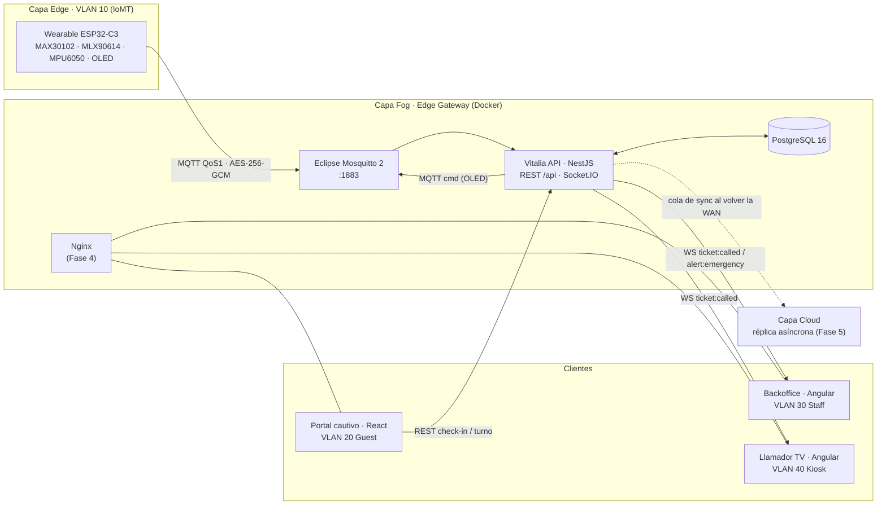
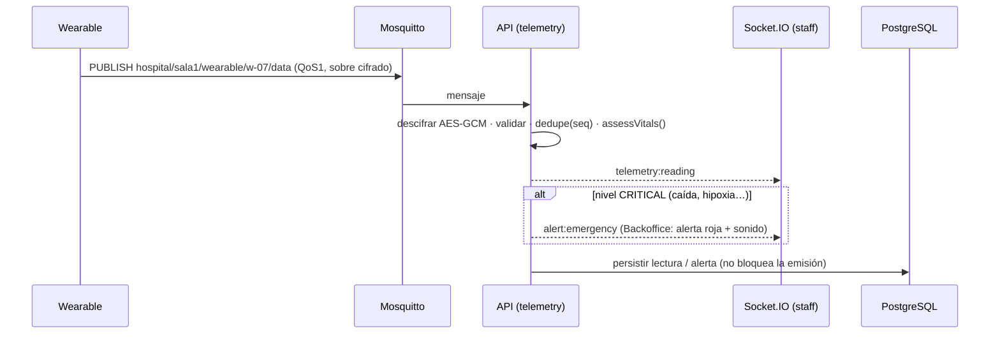
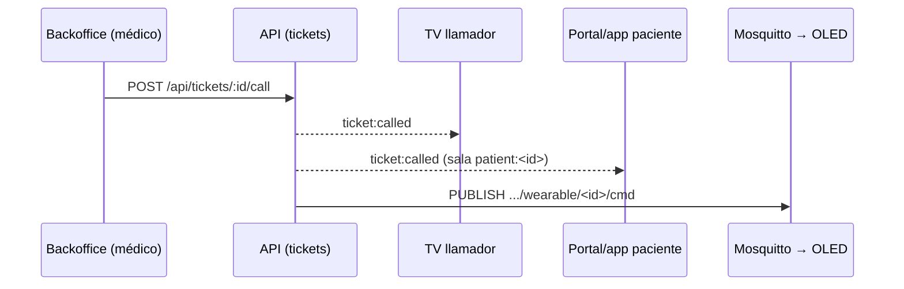
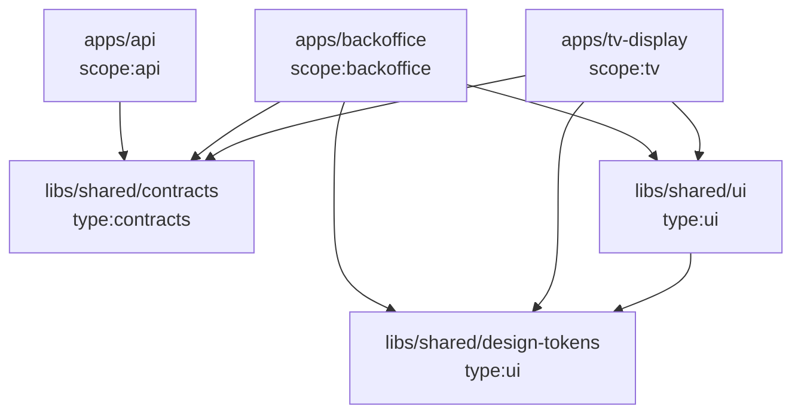

# 01 · Arquitectura

## Vista general (Fog Computing)

## Capas

| Capa      | Componentes                               | Responsabilidad                                                                                                                        |
| --------- | ----------------------------------------- | -------------------------------------------------------------------------------------------------------------------------------------- |
| **Edge**  | Wearables ESP32-C3                        | Leen sensores por I²C, detectan caídas en el dispositivo, cifran (AES-256-GCM) y publican por MQTT. Muestran turno y estado en el OLED |
| **Fog**   | Router RUT956 + Mini PC/laptop con Docker | Broker MQTT, **backend único** NestJS, PostgreSQL, Nginx. Operación autónoma sin WAN                                                   |
| **Cloud** | Servicio remoto (a definir)               | Recibe la réplica asíncrona cuando vuelve internet. Failover 4G/LTE del router                                                         |

## Red y segmentación (router Teltonika RUT956)

| VLAN           | SSID / interfaz                             | Destino permitido    | Protocolos      | Aislamiento                |
| -------------- | ------------------------------------------- | -------------------- | --------------- | -------------------------- |
| 10 · IoMT      | `IoMT_Medical_Secure` (oculto, WPA2/3)      | Mosquitto (Fog)      | MQTT 1883       | Estricto L2, sin internet  |
| 20 · Pacientes | `Hospital_Pacientes_Guest` + portal cautivo | Portal / API pública | HTTP/HTTPS, DNS | Estricto L2 (AP isolation) |
| 30 · Staff     | `Hospital_Staff`                            | API + Backoffice     | HTTPS, WSS      | LAN estándar               |
| 40 · Kiosks/TV | Ethernet                                    | API (Fog)            | HTTP, WS        | Física                     |

## Flujos críticos

### Telemetría y alerta (objetivo < 500 ms)

### Llamado de turno (objetivo < 100 ms)

## Monorepo

Las reglas de dependencia las hace cumplir `@nx/enforce-module-boundaries` (`eslint.config.mjs`):

- Cada `scope:<app>` solo depende de sí mismo y de `scope:shared`.
- La API **no** puede importar `type:ui`.
- `type:contracts` no depende de nada más (TS puro).

### Backend único (monolito modular)

La tesis (§8.3) define **un solo backend NestJS** para maximizar rendimiento y mantenibilidad en el gateway. Los dominios son módulos internos (`apps/api/src/modules/*`). Si en el futuro se necesita, cada módulo se puede extraer a una lib `libs/api/<dominio>`.

| Módulo                             | Fase | Responsabilidad                                                      |
| ---------------------------------- | ---- | -------------------------------------------------------------------- |
| `health`                           | 0 ✅ | Estado del gateway y sus dependencias                                |
| `database`                         | 1 ✅ | TypeORM + PostgreSQL (`src/database`)                                |
| `auth`                             | 1 ✅ | Login del personal (JWT), roles                                      |
| `catalog`, `tickets`, `check-in`   | 1 ✅ | Servicios y consultorios; pacientes, turnos y fila; check-in público |
| `realtime`                         | 2    | Gateway Socket.IO                                                    |
| `telemetry`, `alerts`, `wearables` | 2    | Ingesta MQTT, clasificación, alertas                                 |
| `sync`                             | 5    | Cola de réplica a la nube                                            |

## Despliegue (objetivo Fase 4)

Un `docker compose up` en el gateway levanta `postgres`, `mosquitto`, `api` y `nginx`. Nginx sirve los builds estáticos del Backoffice, la TV y el portal cautivo, y hace de proxy a `/api` y `/socket.io`. Hardware: laptop (prototipo, la batería hace de UPS) o Mini PC Intel N100 / Raspberry Pi 5 (producción).
