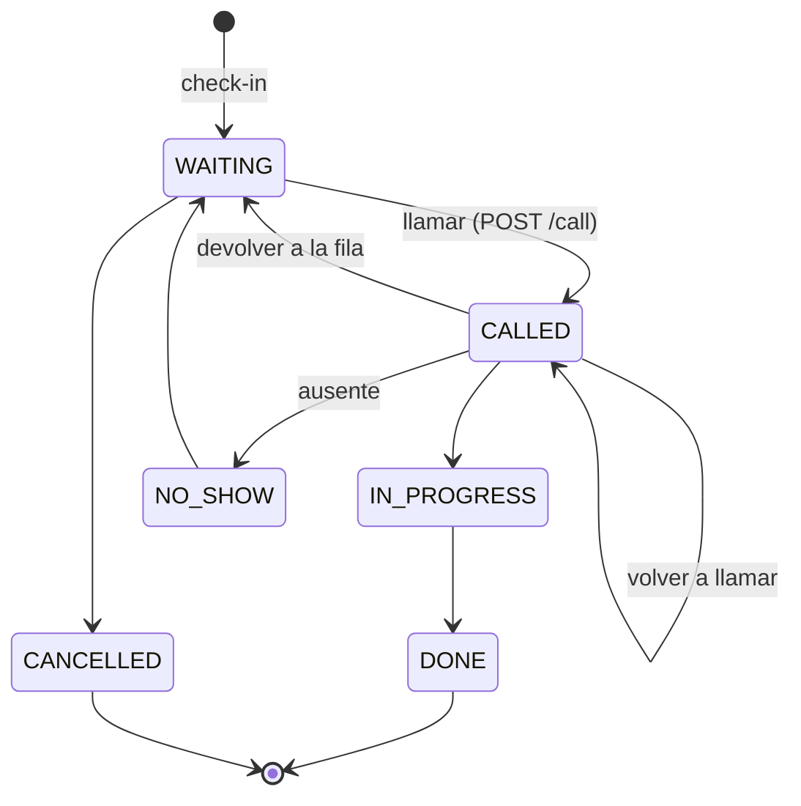

# 04 · Contratos

Fuente de verdad en código: [`libs/shared/contracts`](../libs/shared/contracts) (`@vitalia/contracts`). Este documento lo resume para quien no lee TypeScript (firmware, portal, tesis). Si cambia algo, se actualizan **los dos**.

## REST (`/api`)

Swagger interactivo: `http://localhost:3000/api/docs`.

Autenticación: header `Authorization: Bearer <accessToken>` en todo endpoint salvo los marcados como **público**. Roles: `ADMIN`, `NURSE`, `DOCTOR`, `RECEPTION`.

| Método | Ruta                                | Acceso                       | Descripción                                                                             | Estado |
| ------ | ----------------------------------- | ---------------------------- | --------------------------------------------------------------------------------------- | ------ |
| GET    | `/api/health`                       | público                      | Estado del gateway y de PostgreSQL (`HealthResponse`)                                   | ✅     |
| POST   | `/api/auth/login`                   | público (5/min por IP)       | Login del personal → `LoginResponse` (JWT de 8 h)                                       | ✅ F1  |
| GET    | `/api/auth/me`                      | staff                        | Usuario autenticado (`StaffUser`)                                                       | ✅ F1  |
| GET    | `/api/services`                     | público                      | Servicios de atención (`ServiceArea[]`) para elegir en el check-in                      | ✅ F1  |
| GET    | `/api/consulting-rooms`             | staff                        | Consultorios activos (`ConsultingRoom[]`)                                               | ✅ F1  |
| POST   | `/api/check-in`                     | público (10/min por IP)      | Check-in (`CheckInRequest`) → `PublicTicket`. Idempotente por DNI                       | ✅ F1  |
| GET    | `/api/tickets?status=&serviceCode=` | staff                        | Fila del día (por defecto, turnos abiertos), ordenada por triaje y llegada (`Ticket[]`) | ✅ F1  |
| GET    | `/api/tickets/:id`                  | staff                        | Detalle de un turno (`Ticket`)                                                          | ✅ F1  |
| GET    | `/api/tickets/:id/public`           | público                      | Estado para el paciente (`PublicTicket`: posición y espera estimada)                    | ✅ F1  |
| POST   | `/api/tickets/:id/call`             | `DOCTOR` · `NURSE` · `ADMIN` | Llamar a un consultorio (`CallTicketRequest`)                                           | ✅ F1  |
| PATCH  | `/api/tickets/:id/status`           | staff                        | Cambiar el estado (`UpdateTicketStatusRequest`) según las transiciones permitidas       | ✅ F1  |
| PATCH  | `/api/tickets/:id/triage`           | `NURSE` · `DOCTOR` · `ADMIN` | Triaje manual (`UpdateTriageRequest`)                                                   | ✅ F1  |
| GET    | `/api/wearables`                    | staff                        | Wearables y su última lectura                                                           | Fase 2 |
| POST   | `/api/wearables/:id/assign`         | staff                        | Asignar un wearable a un turno                                                          | Fase 2 |
| GET    | `/api/alerts?active=true`           | staff                        | Alertas activas                                                                         | Fase 2 |
| POST   | `/api/alerts/:id/ack`               | staff                        | Reconocer una alerta                                                                    | Fase 2 |

### Ciclo de vida del turno



Una transición inválida responde **409 Conflict**. La regla está en `TICKET_TRANSITIONS` / `canTransition()` de `@vitalia/contracts`.

### Errores

Formato estándar de NestJS: `{ "statusCode": 400, "message": "…" | ["…"], "error": "Bad Request" }`. Los mensajes de validación están en español para mostrarlos tal cual en el portal o el Backoffice. 401: falta el token o es inválido · 403: rol sin permiso · 404: no existe · 409: transición inválida · 429: demasiados intentos.

### Ejemplos

```http
POST /api/check-in
{ "firstName": "Lucía", "lastName": "Gómez", "documentNumber": "30123456",
  "serviceCode": "CLINICA", "source": "CAPTIVE_PORTAL", "reason": "Fiebre" }

201 → { "id": "…", "code": "A-009", "status": "WAITING", "serviceName": "Clínica Médica",
        "consultingRoomName": null, "position": 4, "estimatedWaitMinutes": 48,
        "checkedInAt": "2026-10-03T22:35:02.559Z", "calledAt": null }
```

### `GET /api/health`

```json
{
  "status": "ok",
  "service": "vitalia-api",
  "version": "0.1.0",
  "environment": "development",
  "uptimeSeconds": 42,
  "timestamp": "2026-10-03T22:00:00.000Z",
  "checks": [
    { "name": "process", "status": "ok" },
    { "name": "database", "status": "ok" }
  ]
}
```

## Tiempo real (Socket.IO, path `/socket.io`)

Constantes: `REALTIME_EVENTS`, `REALTIME_ROOMS`.

| Evento               | Salas                               | Payload                                                                                                  | Fase |
| -------------------- | ----------------------------------- | -------------------------------------------------------------------------------------------------------- | ---- |
| `ticket:called`      | `tv`, `staff`, `patient:<ticketId>` | `TicketCalledEvent { ticketId, ticketCode, consultingRoom, professionalName?, calledAt }`                | 2–3  |
| `queue:updated`      | `staff`, `tv`                       | resumen de la fila                                                                                       | 2–3  |
| `telemetry:reading`  | `staff`                             | `TelemetryReading` + nivel                                                                               | 2    |
| `alert:emergency`    | `staff`                             | `AlertEmergencyEvent { alertId, wearableId, patientId?, ticketCode?, kind, level, message, detectedAt }` | 2    |
| `alert:acknowledged` | `staff`                             | `{ alertId, by, at }`                                                                                    | 2    |

Los signos vitales **solo** se emiten a la sala `staff`.

## MQTT (Mosquitto, puerto 1883, QoS 1)

| Tópico                               | Dirección             | Contenido                              |
| ------------------------------------ | --------------------- | -------------------------------------- |
| `hospital/<sala>/wearable/<id>/data` | wearable → gateway    | Sobre cifrado con la lectura           |
| `hospital/<sala>/wearable/<id>/cmd`  | gateway → wearable    | Comando (ej. mostrar turno en el OLED) |
| `hospital/+/wearable/+/data`         | suscripción de la API | —                                      |

### Identificador del wearable

`<id>` = `wearableId` = `wearables.code` = **`wb-<NN>-<mac>`**, por ejemplo `wb-07-24d7cc` ([ADR 0011](adr/0011-identificador-del-wearable.md)).

- `NN`: número físico de la pulsera, de 01 a 99. En el firmware es `WEARABLE_NUMBER`, en `secrets.h`.
- `mac`: últimos 3 bytes de la MAC Wi-Fi, en hex minúscula.
- En código: `WEARABLE_CODE_PATTERN`, `formatWearableCode()` y `parseWearableCode()` de `@vitalia/contracts`.
- Fase 4: el código también es el usuario de Mosquitto. Su contraseña se carga a mano en el firmware.

### Sobre cifrado (`EncryptedEnvelope`)

```json
{ "v": 1, "iv": "<12 bytes base64>", "ct": "<base64>", "tag": "<16 bytes base64>" }
```

- Algoritmo **AES-256-GCM**. Clave de 32 bytes compartida (`TELEMETRY_AES_KEY`, 64 hex). IV aleatorio por mensaje ([ADR 0006](adr/0006-cifrado-aes-256-gcm.md)).
- Si el tag no valida, el mensaje se descarta.
- **Sin AAD**: el campo `v` viaja en claro y no forma parte de la autenticación.

#### Vectores de prueba compartidos

`GCM_TEST_VECTORS` de `@vitalia/contracts` (`telemetry/gcm-test-vectors.ts`) es la fuente única de vectores AES-256-GCM:

| Vector                    | Qué prueba                                                         |
| ------------------------- | ------------------------------------------------------------------ |
| `nist_tc15`               | Vector oficial del NIST (AES-256, IV de 96 bits, sin AAD)          |
| `vitalia_reading`         | Un `TelemetryReading` de `wb-01-24d7cc`, también en forma de sobre |
| `vitalia_reading_bad_tag` | Tag alterado: el descifrado **tiene que fallar**                   |

- El spec de contracts los verifica con `node:crypto`.
- La API los usa en los tests de descifrado del módulo `telemetry`.
- El firmware los recibe en `apps/wearable-firmware-poc/test/fixtures/gcm_vectors.h`, generado con `pnpm fw:codegen`. La CI corre `pnpm fw:codegen --check` para que no quede desactualizado.
- La clave de los vectores (`00…1f`) es solo para tests: nunca usarla como `TELEMETRY_AES_KEY`.

### Lectura en claro (`TelemetryReading`)

```json
{
  "wearableId": "wb-07-24d7cc",
  "seq": 1532,
  "ts": 1791065563577,
  "hr": 78,
  "spo2": 98,
  "temp": 36.6,
  "accPeakG": 1.02,
  "fall": false
}
```

| Campo      | Unidad   | Notas                                                                                     |
| ---------- | -------- | ----------------------------------------------------------------------------------------- |
| `seq`      | —        | Monotónico, también entre reinicios (ver abajo); la API deduplica por `(wearableId, seq)` |
| `ts`       | ms epoch | Hora del wearable (NTP; ver nota de red en 01-arquitectura)                               |
| `hr`       | BPM      |                                                                                           |
| `spo2`     | %        |                                                                                           |
| `temp`     | °C       | Ya compensada a temperatura clínica                                                       |
| `accPeakG` | g        | Pico del intervalo                                                                        |
| `fall`     | bool     | `true` si el firmware detectó una caída                                                   |

#### `seq` entre reinicios

`seq = arranque × 2^24 + contador` (`composeSeq()` / `splitSeq()` de `@vitalia/contracts`, `SEQ_BOOT_SHIFT = 24`).

- El wearable guarda un contador de **arranques** en su flash (NVS): una escritura por boot.
- El **contador** de mensajes vuelve a 0 en cada arranque. Así, después de reiniciar, `seq` salta al bloque siguiente y sigue creciendo. Si arrancara de 0, la deduplicación descartaría las lecturas nuevas.
- La API puede usar `splitSeq(seq).boot` para detectar reinicios. Un salto de `counter` dentro del mismo `boot` indica mensajes perdidos.
- El simulador de wearables tiene que armar `seq` igual.

#### Constantes para el firmware

Lo que el firmware necesita del contrato (tópicos, `MQTT_QOS`, `ENVELOPE_VERSION`, `TELEMETRY_CIPHER`, `SEQ_BOOT_SHIFT`, el rango del número de wearable y `CLINICAL_THRESHOLDS`) se genera en `apps/wearable-firmware-poc/include/vitalia_contracts.h` con `pnpm fw:codegen`. La CI verifica que esté al día.

### Comando al wearable (propuesta, Fase 2)

```json
{ "type": "SHOW_TICKET", "ticketCode": "A-024", "consultingRoom": "Cons. 4" }
```

## Portal cautivo ↔ API (Fase 4)

El portal (`pti-captive-portal`) hoy espera `/auth/*`. En la Fase 4 se alinea con este contrato: `GET /api/services`, `POST /api/check-in` y polling o socket de `GET /api/tickets/:id/public`. Su `VITE_BASE_URL` apunta a la API del gateway (CORS ya incluye `http://localhost:5173`).
