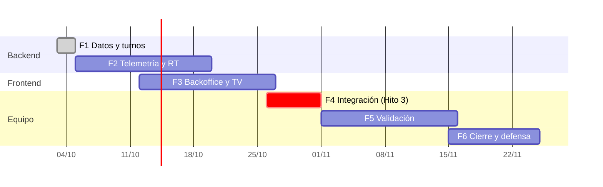

# 07 · Roadmap e implementación por fases

> Plan vivo: marcá los checkboxes a medida que avanzan (skill `vitalia-docs`). Las fechas son **tentativas** y se alinean a los hitos de la tesis: **Hito 3 (octubre 2026)**, ecosistema integrado de punta a punta. **Hito 4 (noviembre 2026)**, validación y defensa.
> Responsables: **G** = Gastón (backend Fog) · **T** = Tomás (interfaces) · **F** = Facundo (hardware/red) · **Eq** = equipo.

## Resumen

| Fase | Objetivo                                  | Fechas    | Resp.  | Estado                  |
| ---- | ----------------------------------------- | --------- | ------ | ----------------------- |
| 0    | Fundaciones del monorepo                  | 3 oct     | G      | ✅ Completa             |
| 1    | Núcleo de datos, turnos y auth            | 3–4 oct   | G      | ✅ Completa             |
| 2    | Telemetría MQTT, alertas y tiempo real    | 5–19 oct  | G (+F) | ⏳ Siguiente            |
| 3    | Backoffice y llamador TV funcionales      | 12–26 oct | T      | Pendiente (en paralelo) |
| 4    | Integración de punta a punta (**Hito 3**) | 26–31 oct | Eq     | Pendiente               |
| 5    | Resiliencia, carga y validación           | 1–15 nov  | Eq     | Pendiente               |
| 6    | Landing, memoria y defensa (**Hito 4**)   | nov       | Eq     | Pendiente               |

---

## Fase 0 · Fundaciones ✅

- [x] Workspace Nx 23 (pnpm, preset integrado Angular) — [ADR 0001](adr/0001-monorepo-nx.md)
- [x] `apps/api` NestJS 11: config validada (zod), `/api`, CORS, ValidationPipe, Swagger, `GET /api/health` + tests
- [x] `apps/backoffice` Angular 22 + Material M3 con identidad Vitalia, chequeo de API, vista previa de triaje
- [x] `apps/tv-display` Angular 22: pantalla del llamador (datos de ejemplo)
- [x] `libs/shared/contracts`: health, eventos WS, tópicos MQTT, umbrales y `assessVitals()` + tests
- [x] `libs/shared/design-tokens` (SCSS + TS + assets) y `libs/shared/ui` (logo, tema)
- [x] `docker-compose.yml`: PostgreSQL 16 + Mosquitto 2
- [x] Límites de módulos por tags, ESLint, Prettier, Husky + commitlint, CI con `nx affected`
- [x] Contexto IA: `AGENTS.md` raíz y por proyecto, punteros para cada herramienta, 8 skills del proyecto, skills y MCP de Nx
- [x] Documentación base (`docs/`) y ADRs iniciales

## Fase 1 · Núcleo de datos, turnos y auth (G) ✅

**Objetivo:** que la API persista pacientes y turnos, exponga la fila, el check-in y el llamado, y tenga login del personal.

- [x] ORM decidido: **TypeORM 1.1** ([ADR 0009](adr/0009-orm-typeorm.md); Prisma rechazado, [ADR 0005](adr/0005-orm-prisma.md))
- [x] Módulo `database` (TypeORM + PostgreSQL) y check de la base en `/api/health`
- [x] Esquema inicial + migración: `staff_users`, `service_areas`, `consulting_rooms`, `patients`, `tickets`, `wearables`, `telemetry_readings`, `alerts` ([08-modelo-datos.md](08-modelo-datos.md))
- [x] Seed determinístico e idempotente con datos simulados: servicios, consultorios, personal, wearables y 14 turnos del día
- [x] Contratos en `@vitalia/contracts`: auth/roles, catálogo, turnos (estados, transiciones, orden de la fila, código), check-in
- [x] Módulo `tickets`: fila ordenada, detalle, vista pública con posición y espera, llamado, cambio de estado, triaje manual
- [x] Módulo `check-in` público, idempotente por DNI y con rate limit (10/min)
- [x] Módulo `auth`: login JWT (8 h), roles (`ADMIN`, `NURSE`, `DOCTOR`, `RECEPTION`), guards globales (`@Public`, `@Roles`), login limitado a 5/min
- [x] Módulo `catalog`: servicios (público) y consultorios
- [x] Skill `vitalia-database` + `pnpm ai:sync`
- [x] Tests: 22 en la API (unitarios + integración contra PostgreSQL en CI) y 11 en contracts
- [x] REST de turnos < 50 ms: **p50 ≈ 5 ms, p95 ≈ 9 ms** en local

**Terminado ✅:** desde Swagger se puede loguear, hacer check-in, ver la fila y llamar un turno, y todo queda persistido.

## Fase 2 · Telemetría MQTT, alertas y tiempo real (G + F)

- [x] Firmware del wearable migrado al monorepo con su historial: `apps/wearable-firmware-poc`, targets `pio-*`, job `firmware` en CI ([ADR 0010](adr/0010-firmware-del-wearable-en-el-monorepo.md)) (F)
- [ ] Firmware: publicar `TelemetryReading` (con `seq` y `ts` en ms), reemplazando el payload del POC (`device_id`, `bpm`, `temp_c`, `event`) (F)
- [ ] Firmware: MQTT con PubSubClient contra Mosquitto (Hito 6b), QoS 1 y `setBufferSize(512)` (F)
- [ ] Firmware: sobre AES-256-GCM `{ v, iv, ct, tag }` con los mismos vectores de prueba que la API (Hito 7) (F)
- [ ] Firmware: suscripción a `.../cmd` y `SHOW_TICKET` en el OLED (F)

- [ ] Emitir eventos de dominio desde `tickets` (hoy hay un `// Fase 2` en `TicketsService.call`)
- [ ] Módulo `realtime`: gateway Socket.IO con salas `staff` / `tv` / `patient:<id>` — [ADR 0007](adr/0007-tiempo-real-socket-io.md)
- [ ] `ticket:called` y `queue:updated` emitidos desde `tickets`
- [ ] Módulo `telemetry`: cliente MQTT, suscripción `hospital/+/wearable/+/data`, QoS 1
- [ ] Descifrado AES-256-GCM + tests con vectores — [ADR 0006](adr/0006-cifrado-aes-256-gcm.md) (F: mismo esquema en el firmware)
- [ ] Validación (zod), deduplicación por `seq`, `assessVitals()`, persistencia sin bloquear la emisión
- [ ] Módulo `alerts`: creación ante `CRITICAL`, `alert:emergency`, reconocimiento (`ack`)
- [ ] Módulo `wearables`: alta, asignación a un turno, última lectura, comando al OLED (`.../cmd`)
- [ ] `tools/wearable-simulator`: N pulseras simuladas, anomalías inyectables, cifrado real
- [ ] Check de MQTT en `/api/health`

**Terminado cuando:** con el simulador corriendo, una caída simulada genera `alert:emergency` en < 500 ms y queda persistida.

## Fase 3 · Backoffice y llamador TV (T, en paralelo desde el 12/10)

> Se puede arrancar contra los contratos y datos mock antes de que la API de la Fase 1 y 2 esté lista.

- [ ] Login del personal + guard + interceptor JWT
- [ ] Layout con navegación (Triaje · Alertas · Turnos · Wearables) y estado de conexión
- [ ] Servicio `realtime` (socket.io-client) con reconexión
- [ ] **Fila de triaje** priorizada en vivo (nivel → hora), con signos vitales y motivos
- [ ] **Panel de alertas**: modal rojo intermitente + sonido, reconocer alerta (RF-O4)
- [ ] **Llamar turno** desde la fila → TV
- [ ] Vista de wearables (asignación, batería/conexión, última lectura)
- [ ] TV: suscripción a `ticket:called`, historial, aviso sonoro o voz, reconexión
- [ ] Responsivo (RNF-O4), modo claro/oscuro, tests de componentes

**Terminado cuando:** un llamado desde el Backoffice aparece en la TV, y una alerta del simulador dispara el aviso visual y sonoro.

## Fase 4 · Integración de punta a punta — Hito 3 (Eq)

- [ ] Portal cautivo → check-in y estado del turno contra la API (repo `pti-captive-portal`, `VITE_BASE_URL` al gateway)
- [ ] Wearable real publicando cifrado en Mosquitto (F) y recibiendo el turno en el OLED
- [ ] Dockerfile multi-stage de la API + Nginx (Backoffice, TV, portal, proxy `/api` y `/socket.io`) en `docker-compose`
- [ ] Mosquitto con usuario/contraseña y ACL por wearable
- [ ] RUT956: VLANs 10/20/30/40 apuntando al gateway; portal cautivo con walled garden (F)
- [ ] Guion de demo E2E documentado

**Terminado (Hito 3) cuando:** el llamado emitido desde el Backoffice se ve al instante en la TV, en el portal del paciente y en el OLED del wearable.

## Fase 5 · Resiliencia, carga y validación (Eq)

- [ ] Módulo `sync`: outbox local → réplica a la nube al volver la WAN (RF-O6, capa Cloud)
- [ ] Prueba de corte de WAN durante 24 h (RNF-O2)
- [ ] Carga: 50 pulseras cada 3 s (simulador) y 0 % de pérdida con QoS 1
- [ ] Medición de latencias (alerta < 500 ms, REST < 50 ms, llamado < 100 ms) con reporte
- [ ] Estrés con > 10.000 registros simulados en la consola
- [ ] Escaneo de puertos en la red guest (aislamiento al 100 %)
- [ ] Resultados volcados al capítulo 12 de la tesis

## Fase 6 · Cierre y defensa — Hito 4 (Eq)

- [ ] Landing page de Vitalia (nueva app en el monorepo, con la misma identidad)
- [ ] Documentación final y actualización de la tesis (capítulos 12–14, "Diferencias con la tesis")
- [ ] Video y demo, presentación para la defensa

## Backlog opcional

- App del paciente en Flutter (APK + PWA), según la tesis
- RF-D1 notificaciones push · RF-D3 reportes PDF · RNF-D2 i18n (es/en) · RF-D2 mesh
- Extraer los módulos de la API a libs `libs/api/<dominio>` si la API crece
