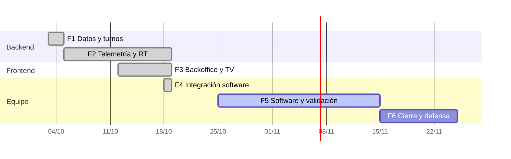

# 07 · Roadmap e implementación por fases

> Plan vivo: marcá los checkboxes a medida que avanzan (skill `vitalia-docs`). Las fechas son **tentativas** y se alinean a los hitos de la tesis: **Hito 3 (octubre 2026)**, ecosistema integrado de punta a punta. **Hito 4 (noviembre 2026)**, validación y defensa.
> Responsables: **G** = Gastón (backend Fog) · **T** = Tomás (interfaces) · **F** = Facundo (hardware/red) · **Eq** = equipo.

## Resumen

| Fase | Objetivo                                | Fechas        | Resp.  | Estado                                |
| ---- | --------------------------------------- | ------------- | ------ | ------------------------------------- |
| 0    | Fundaciones del monorepo                | 3 oct         | G      | ✅ Completa                           |
| 1    | Núcleo de datos, turnos y auth          | 3–4 oct       | G      | ✅ Completa                           |
| 2    | Telemetría MQTT, alertas y tiempo real  | 5–18 oct      | G (+F) | ✅ Software · ⏳ placa                |
| 3    | Backoffice y llamador TV funcionales    | 12–18 oct     | G (T)  | ✅ Completa                           |
| 4    | Despliegue e integración del software   | 18 oct        | G      | ✅ Software completo                  |
| —    | Red, router y portal cautivo            | —             | Eq     | ✅ Proyecto aparte                    |
| 5    | Software pendiente, carga y validación  | 25 oct–15 nov | Eq     | ✅ Software (5a–5c) · ⏳ 24 h WAN, 5d |
| 6    | Landing, memoria y defensa (**Hito 4**) | nov           | Eq     | ⏳ Landing lista (25/10)              |

```mermaid
gantt
  dateFormat YYYY-MM-DD
  axisFormat %d/%m
  section Backend
  F1 Datos y turnos        :done, f1, 2026-10-03, 2d
  F2 Telemetría y RT       :done, f2, 2026-10-05, 14d
  section Frontend
  F3 Backoffice y TV       :done, f3, 2026-10-12, 7d
  section Equipo
  F4 Integración software :done, f4, 2026-10-18, 1d
  F5 Software y validación :active, f5, 2026-10-25, 21d
  F6 Cierre y defensa      :f6, 2026-11-15, 10d
```

---

## Fase 0 · Fundaciones ✅

- [x] Workspace Nx 23 (pnpm, preset integrado Angular) — [ADR 0001](adr/0001-monorepo-nx.md)
- [x] `apps/api` NestJS 11: config validada (zod), `/api`, CORS, ValidationPipe, Swagger, `GET /api/health` + tests
- [x] `apps/backoffice` Angular 22 + Material M3 con identidad Vitalia, chequeo de API, vista previa de triaje
- [x] `apps/tv-display` Angular 22: pantalla del llamador (datos de ejemplo)
- [x] `libs/shared/contracts`: health, eventos WS, tópicos MQTT, umbrales y `assessVitals()` + tests
- [x] `libs/shared/design-tokens` (SCSS + TS + assets) y `libs/shared/ui` (logo, tema)
- [x] `docker-compose.yml`: PostgreSQL 16 + Mosquitto 2
- [x] Límites de módulos por tags, ESLint, Prettier, Husky + commitlint, CI con `nx affected`
- [x] Contexto IA: `AGENTS.md` raíz y por proyecto, punteros para cada herramienta, 8 skills del proyecto, skills y MCP de Nx
- [x] Documentación base (`docs/`) y ADRs iniciales

## Fase 1 · Núcleo de datos, turnos y auth (G) ✅

**Objetivo:** que la API persista pacientes y turnos, exponga la fila, el check-in y el llamado, y tenga login del personal.

- [x] ORM decidido: **TypeORM 1.1** ([ADR 0009](adr/0009-orm-typeorm.md); Prisma rechazado, [ADR 0005](adr/0005-orm-prisma.md))
- [x] Módulo `database` (TypeORM + PostgreSQL) y check de la base en `/api/health`
- [x] Esquema inicial + migración: `staff_users`, `service_areas`, `consulting_rooms`, `patients`, `tickets`, `wearables`, `telemetry_readings`, `alerts` ([08-modelo-datos.md](08-modelo-datos.md))
- [x] Seed determinístico e idempotente con datos simulados: servicios, consultorios, personal, wearables y 14 turnos del día
- [x] Contratos en `@vitalia/contracts`: auth/roles, catálogo, turnos (estados, transiciones, orden de la fila, código), check-in
- [x] Módulo `tickets`: fila ordenada, detalle, vista pública con posición y espera, llamado, cambio de estado, triaje manual
- [x] Módulo `check-in` público, idempotente por DNI y con rate limit (10/min)
- [x] Módulo `auth`: login JWT (8 h), roles (`ADMIN`, `NURSE`, `DOCTOR`, `RECEPTION`), guards globales (`@Public`, `@Roles`), login limitado a 5/min
- [x] Módulo `catalog`: servicios (público) y consultorios
- [x] Skill `vitalia-database` + `pnpm ai:sync`
- [x] Tests: 22 en la API (unitarios + integración contra PostgreSQL en CI) y 11 en contracts
- [x] REST de turnos < 50 ms: **p50 ≈ 5 ms, p95 ≈ 9 ms** en local

**Terminado ✅:** desde Swagger se puede loguear, hacer check-in, ver la fila y llamar un turno, y todo queda persistido.

## Fase 2 · Telemetría MQTT, alertas y tiempo real (G + F)

- [x] Firmware del wearable migrado al monorepo con su historial: `apps/wearable-firmware-poc`, targets `pio-*`, job `firmware` en CI ([ADR 0010](adr/0010-firmware-del-wearable-en-el-monorepo.md)) (F)
- [x] Firmware reestructurado (`lib/` telemetry, fall_detection, sensors, net, ui + `config.h`) con tests native en CI (`pnpm fw:test`) (F)
- [x] Firmware: arma `TelemetryReading` cada 3 s (`seq` por arranque en NVS, `ts` en ms) y la expone por HTTP `/data` (etapa previa a la publicación por MQTT del ítem siguiente) (F)
- [x] Firmware: publicar `TelemetryReading` cifrada por MQTT (con `seq` y `ts` en ms), reemplazando el payload del POC (`device_id`, `bpm`, `temp_c`, `event`) (F)
- [x] Firmware: MQTT con ESP-MQTT contra Mosquitto, QoS 1 y outbox (Hito 6b, [ADR 0012](adr/0012-esp-mqtt-en-el-firmware.md)) — probado en la placa el 21/10 contra el Mosquitto de desarrollo y contra el gateway con credenciales por pulsera (con un puente temporal: el broker del gateway sigue en loopback) (F)
- [x] Código de wearable `wb-<NN>-<mac>` en contracts, seed y firmware ([ADR 0011](adr/0011-identificador-del-wearable.md)) (F)
- [x] Vectores AES-256-GCM compartidos: `GCM_TEST_VECTORS` en contracts → `gcm_vectors.h` del firmware (`pnpm fw:codegen`, check en CI) (F)
- [x] Firmware: hora por NTP (`configTime` con `NTP_SERVER`); en desarrollo, NTP público (red única con internet) (F)
- [x] `pnpm fw:mqtt-check`: descifra y valida la telemetría contra el contrato (referencia para el módulo `telemetry`) (F)
- [x] Firmware: sobre AES-256-GCM `{ v, iv, ct, tag }` en `lib/crypto` + test Unity que pase los vectores de `test/fixtures/gcm_vectors.h` (Hito 7) — 3/3 en la placa el 21/10 (F)
- [x] Rangos físicos de la lectura en contracts (`TELEMETRY_READING_LIMITS`), compartidos por API, `fw:mqtt-check` y firmware: el wearable omite `temp`/`hr`/`spo2` fuera de rango y satura `accPeakG` en 16 g, para que la API no descarte la lectura entera (hallazgo de la prueba en la placa del 21/10) (F)
- [x] Firmware: suscripción a `.../cmd` y `SHOW_TICKET` en el OLED — software completado en 4c; probado en la placa el 21/10 (llamado, reemplazo, scroll y tildes/ñ), falta ver la prioridad de una caída local (G; F: placa)
- [x] Firmware: detección de caídas en tres fases (caída libre → impacto > 2,8 g → inmovilidad) en `lib/fall_detection`, con tests native; la caída confirmada se publica sin esperar el ciclo de 3 s (Hito 8) — lógica validada en la protoboard el 21/10; la calibración espera la pulsera con el circuito soldado (F)
- [x] Firmware: `contracts.h` generado (como `include/vitalia_contracts.h`, `pnpm fw:codegen`) desde `@vitalia/contracts` (tópicos y umbrales) con un check en CI de que no quedó desactualizado; hoy `implicitDependencies` solo recompila, no detecta divergencias (F)

- [x] Emitir eventos de dominio desde `tickets`: check-in, llamado, estado y triaje (G)
- [x] Módulo `realtime`: gateway Socket.IO con salas `staff` (JWT en el handshake) / `tv` / `patient:<id>`, `realtime:ready` y `realtime:error` — [ADR 0007](adr/0007-tiempo-real-socket-io.md) (G)
- [x] `ticket:called` y `queue:updated` emitidos desde `tickets`; al finalizar o cancelar un turno se libera la pulsera (G)
- [x] Módulo `mqtt` (cliente único, reconexión, QoS 1) y módulo `telemetry`: suscripción `hospital/+/wearable/+/data` (G)
- [x] Descifrado AES-256-GCM + tests con `GCM_TEST_VECTORS` (`@vitalia/contracts/testing`) + descartar si el `wearableId` descifrado no coincide con el del tópico — [ADR 0006](adr/0006-cifrado-aes-256-gcm.md) (G; F: mismos vectores en el firmware)
- [x] Validación (zod), deduplicación por `seq` (memoria + índice único), pulseras no dadas de alta descartadas, `vitalsFindings()`/`assessVitals()`, persistencia en segundo plano después de emitir; el triaje del turno solo sube (G)
- [x] Módulo `alerts`: una alerta por hallazgo CRÍTICO sin repetir la activa del mismo tipo, `alert:emergency` antes de persistir, `GET /api/alerts`, `POST /api/alerts/:id/ack` → `alert:acknowledged` (G)
- [x] Módulo `wearables`: alta validando formato y **número** sin repetir (ADR 0011), asignar/liberar, última lectura, `online`, sala del tópico y `SHOW_TICKET` a `.../cmd` al llamar (G)
- [x] Migración `Fase2Iomt`: `seq` a `bigint` (con el arranque en los bits altos superaba int32), índice único `(wearable_id, seq)`, `wearables.last_room` (G)
- [x] `tools/wearable-simulator` (`pnpm sim:wearables`): N pulseras simuladas, anomalías inyectables (caída, hipoxia, taquicardia…), eventos de prueba (reinicio, duplicado, tag alterado, tópico ajeno) y cifrado real. Probado contra Mosquitto con `fw:mqtt-check` y con 50 pulseras (F)
- [x] Check de MQTT en `/api/health` (`degraded` si no está configurado o no conecta: los turnos siguen) (G)
- [x] Test de integración de punta a punta con broker en proceso (aedes) y Socket.IO real: caída → `alert:emergency`, dedupe, spoof, tag alterado, `ack`, llamado → TV/paciente/`SHOW_TICKET`, alta y asignación de pulseras (G)

**Terminado ✅ (lado API, 18/10):** con `pnpm sim:wearables --inject=fall:3@4` y la API corriendo, la caída llega a la sala `staff` como `alert:emergency` **~8 ms** después del `ts` del wearable y queda persistida; el test de integración mide ~15 ms entre publicar y recibir (objetivo < 500 ms). El simulador confirma el descarte de `tamper` y `spoof` y la deduplicación de `duplicate`. El receptor y estado de `SHOW_TICKET` en el firmware se completaron como software en 4c; la validación en placa sigue fuera de este cierre.

## Fase 3 · Backoffice y llamador TV ✅

> La terminó el backend (G) el 18/10, adelantando la parte de Tomás para llegar al Hito 3 con todo integrado.

- [x] Login del personal + guards (`authGuard`, `guestGuard`) + interceptor JWT (401 → login con "sesión vencida") (3a)
- [x] Layout con navegación (Triaje · Turnos · Alertas · Pulseras), estado de la conexión en vivo, sonido, usuario y estado del gateway (3a)
- [x] Servicio `realtime` (socket.io-client): JWT en el handshake, `realtime:ready`/`realtime:error`, reconexión y re-sincronización al reconectar (3a)
- [x] **Fila de triaje** priorizada en vivo (nivel → hora), con signos vitales de la pulsera, motivos, espera y filtro por servicio (3b)
- [x] **Panel de alertas**: aviso rojo intermitente + alarma Web Audio, reconocer, minimizar, historial con quién reconoció (RF-O4) (3b)
- [x] **Llamar turno** desde la fila (diálogo de consultorio) → TV, portal y OLED; acciones de estado y triaje manual según rol y `canTransition` (3c)
- [x] Página **Turnos**: todos los del día, filtro por estado y búsqueda (3c)
- [x] API: `GET /api/tickets/recent-calls` (público) para que la TV se ponga al día al arrancar o reconectar (3c)
- [x] TV: `ticket:called` en vivo, historial de 5, destello, campanita + voz (`speechSynthesis`), reconexión y último estado guardado (3c)
- [x] Vista de pulseras: conexión en vivo, sala, turno, última lectura, alta, asignar y liberar (3d). La batería no está en el contrato todavía (ver firmware)
- [x] Responsivo de 360 px a escritorio, modo claro/oscuro, 26 tests en el Backoffice y 8 en la TV (3d)
- [x] `API_PORT` en lugar de `PORT`: el dev-server de Angular tomaba `PORT=3000` del `.env` y Backoffice/TV no levantaban en 4200/4300

**Terminado ✅ (18/10):** probado en Chromium con la API, el broker y el simulador corriendo. Una caída simulada abre el aviso rojo en el Backoffice (~3 s desde lanzar el simulador, que tarda en arrancar; la API la emite en milisegundos) y un llamado aparece en la TV **113 ms** después del click en "Llamar".

## Fase 4 · Despliegue e integración del software (G) ✅

> Alcance acordado el 18/10: desarrollo del monorepo y validación con simuladores. El firmware entra como código, compilación y tests sin placa.
>
> **25/10: red y portal cautivo fuera de este monorepo.** El router RUT956, las VLANs, el portal cautivo con su walled garden y el NTP de la red se resuelven en otro proyecto del equipo, prácticamente terminado. Acá se dan por resueltos; el contrato que usa el portal (`GET /api/services`, `POST /api/check-in`, `GET /api/tickets/:id/public` y el socket `{ ticketId }`) sigue en [04-contratos.md](04-contratos.md).
>
> - [x] ~~Portal cautivo → check-in y estado del turno contra la API~~ → proyecto de red y portal
> - [x] ~~RUT956: VLANs 10/20/30/40 apuntando al gateway, walled garden y NTP local para la VLAN 10~~ → proyecto de red y portal
> - [x] ~~Escaneo de puertos en la red guest~~ → proyecto de red y portal

### 4a · Despliegue reproducible del gateway — completo (18/10)

- [x] Imágenes multi-stage: API con dependencias de producción, Backoffice y TV estáticos con Nginx; proxies `/api` y `/socket.io`.
- [x] Compose independiente del entorno dev, migraciones al arrancar, volúmenes y healthchecks.
- [x] Configuración local con credenciales aleatorias, sin sobrescribir secretos existentes; seed simulado explícito.
- [x] Smoke de ambos orígenes: HTML, rutas SPA, health, PostgreSQL, MQTT y Socket.IO (WebSocket y polling); guía y job CI definido.

**Verificado localmente (18/10):** imágenes construidas desde cero, migraciones aplicadas y seed dentro de la imagen final (3 servicios, 5 consultorios, 5 usuarios, 8 pulseras y 14 turnos). Smoke OK en `localhost:8080` y `localhost:8081`; 2 tests del inicializador y `pnpm affected` en verde (7 proyectos, 16 tareas). El job CI está configurado; su ejecución remota no se acredita en esta validación local.

También se verificó parada y recreación del stack sin borrar volúmenes: usuarios, IDs de turnos y credenciales se conservan; login y smoke pasan después del segundo arranque.

### 4b · Seguridad MQTT — completo (18/10)

- [x] Usuarios y ACL por wearable, usuario propio de la API y cuenta de health restringida, con aprovisionamiento reproducible sin versionar secretos; altas, rotación y bajas explícitas ([ADR 0014](adr/0014-identidades-y-acl-mqtt.md)).
- [x] Pruebas contra Mosquitto real: anónimos y contraseña incorrecta rechazados, escrituras cruzadas denegadas con PUBACK `0x87` y aislamiento de entregas aun con filtros amplios; simulador con credenciales por pulsera (`--gateway`).

**Verificado localmente (18/10):** actualización del stack 4a sin borrar volúmenes, broker autenticado y health OK; se conservan los 14 turnos del seed. Dos pulseras enviaron 7 lecturas cifradas, confirmadas por QoS 1 y persistidas en PostgreSQL. Smoke de Backoffice/TV y Socket.IO en verde. Los tests del aprovisionador cubren idempotencia, conservación de secretos, altas y revocación; CI incorpora el check MQTT real. El transporte sigue siendo TCP en loopback, sin TLS ni validación física o de red.

Segundo arranque verificado: archivos de credenciales idénticos, MQTT y smoke otra vez en verde. `pnpm affected` pasó sus 16 tareas de lint/test/build en 7 proyectos; los 7 tests operativos de inicialización, entorno y aprovisionamiento también pasaron. La ejecución remota del job CI queda pendiente; este cierre acredita las comprobaciones locales.

### 4c · Comandos en el firmware — completo como software (18/10)

- [x] Suscripción QoS 1 al código propio en cualquier sala, validación y reensamblado acotado de `SHOW_TICKET`, estado del llamado en OLED y resuscripción al reconectar. Cola FreeRTOS hacia el `loop()`, sin acceso a I²C desde MQTT ([ADR 0015](adr/0015-recibir-comandos-en-el-firmware.md)).
- [x] Tests native de parser, fragmentos, estado, scroll/UTF-8 y adaptador MQTT real con SDK de prueba; compilación con SDK ESP32-C3 sin exigir placa, flasheo ni calibración. MAX30102 no bloquea este cierre: el simulador aporta `hr` y `spo2`.

**Verificado localmente (18/10):** `pio-check-docker` ejecutó 43 tests native (11 nuevos) y compiló el firmware ESP32-C3 con la plantilla de secretos. También compiló los tests de cifrado de placa sin subirlos ni ejecutarlos. `pnpm affected` pasó 16 tareas en 7 proyectos y los headers generados están al día. El llamado se conserva en RAM hasta reemplazo o reinicio, con indicador sin red y prioridad temporal de caída local; no hay limpieza automática al finalizar ni recuperación de comandos perdidos durante cortes. El E2E sobre Docker corresponde a 4d y la ejecución física sigue pendiente.

### 4d · Pruebas integradas de software — completo (18/10)

- [x] Check-in por API → asignación de pulsera simulada desde UI → telemetría AES-GCM por Mosquitto autenticado y persistencia → caída y reconocimiento en Backoffice → llamado desde UI en TV y recepción de `SHOW_TICKET` por un cliente MQTT.
- [x] Resincronización sin recargar Backoffice/TV tras cortes de sus conexiones: recuperar turnos, signos vitales, alertas nuevas y último llamado; quitar una alerta reconocida desde otro cliente durante el corte. Reconexión del cliente MQTT antes del segundo comando.

**Verificado localmente (18/10):** `pnpm gateway:e2e` pasó un escenario de ocho pasos en Chromium contra los builds reales de Docker (9,7 s de recorrido). No usa mocks de negocio ni borra la base: crea fixtures simulados sin DNI y cierra sus turnos/reconoce sus alertas; los 14 turnos originales del seed se conservaron. El E2E reprodujo una alerta reconocida que quedaba activa al reconectar; se corrigió la conciliación por IDs y versiones de consulta, con cuatro regresiones nuevas. Los 30 tests del Backoffice, el typecheck E2E, las 16 tareas de `pnpm affected`, smoke y ACL MQTT pasaron. [ADR 0016](adr/0016-validar-gateway-con-navegadores-reales.md).

El job CI del gateway incluye instalación de Chromium y E2E; su ejecución remota no se acredita con estas pruebas locales. Los cortes simulados afectan a los navegadores, no al gateway ni a la WAN; el receptor MQTT es un cliente de prueba, sin placa ni OLED físico.

### 4e · Operación y demo — completo (18/10)

- [x] Demo visible con pausas y guion: reutiliza el recorrido 4d con pacientes simulados sin DNI. `gateway:verify` unifica tests operativos, typecheck, smoke, ACL y E2E.
- [x] Diarios locales por UUID y recuperación idempotente de corridas interrumpidas; consulta por marcador para respuestas HTTP perdidas y validación de pertenencia antes de modificar. Bloqueo exclusivo entre operaciones de demo/pruebas/recuperación/respaldo.
- [x] Tests reales de parada/recreación con persistencia de turno, asignación, lectura y credenciales; reconexión de Backoffice/TV sin recarga; reinicio del broker con nueva ingesta y comando MQTT.
- [x] Respaldo conjunto de PostgreSQL/configuración/diarios con hashes y restauración automática en PostgreSQL efímero aislado. Guía de arranque, parada, diagnóstico, recuperación y restauración real; [ADR 0017](adr/0017-operar-y-recuperar-el-gateway.md).

**Verificado localmente (18/10):** 11 tests operativos unitarios (4 nuevos), suite operativa de cuatro pasos (~36 s de recorrido), demo con pausas (~38 s), `gateway:verify`, comandos públicos de respaldo/restauración/recuperación y las 16 tareas de `pnpm affected` en siete proyectos en verde. Se ensayó además una copia de fuentes sin `.env`, `node_modules` ni volúmenes previos: instalación congelada usando caché local, construcción de imágenes, credenciales nuevas, puertos separados, seed de 14 turnos y `gateway:verify` completo con el E2E de 4d. Chromium ya estaba instalado en el host. La copia no reutilizó secretos ni datos de la instalación habitual.

**Cierre de software acreditado:** desde una copia limpia se levanta el gateway Docker y se completa el recorrido de 4d con checks en verde, sin depender del portal, router ni hardware físico. La restauración se probó en una base aislada; no se acredita un traslado completo a otra máquina. CI incorpora verificación y prueba operativa, con ejecución remota todavía pendiente. La prueba WAN de 24 h, carga, latencias y sincronización Cloud continúan en Fase 5. Guía: [09-despliegue-gateway.md](09-despliegue-gateway.md).

## Fase 5 · Software pendiente, carga y validación (Eq)

> Solo desarrollo del monorepo (Backoffice, TV, API, firmware y herramientas). Red y portal cautivo: proyecto aparte.

### 5a · Backoffice y API: lo que le falta a la consola (G) — completo (25/10)

- [x] Check-in desde recepción en el Backoffice (`source: RECEPTION`, ya previsto en el contrato) para pacientes que no usan el portal
- [x] Detalle del paciente con la curva de signos vitales: `GET /api/tickets/:id/readings` + gráfico en el Backoffice (base de RF-D3)
- [x] Pulsera en mantenimiento: cambiar el estado desde el Backoffice (`PATCH /api/wearables/:id`) y sacarla de la asignación
- [x] TV por servicio (`?servicio=GUARDIA`) para tener una pantalla por sala de espera

**Verificado localmente (25/10):** se probó en Chromium contra la API compilada, con broker y simulador: la curva de 30 min a 24 h (tooltip sincronizado, bandas normales, marca de la caída y vista de tabla), el check-in de recepción con la posición en la fila, una pulsera puesta en mantenimiento y devuelta, y una TV en `?servicio=guardia` que mostró el llamado de Guardia e ignoró el de Clínica. La API tiene 107 tests y el Backoffice 36.

### 5b · API: operación de largo plazo (G) — completo (25/10)

- [x] Retención de telemetría: con 50 pulseras cada 3 s son ~1,4 M de lecturas por día. Política de borrado o agregación configurable para operar 24 h+ sin degradar la base
- [x] Módulo `sync`: outbox local → réplica a la nube al volver la WAN (RF-O6, capa Cloud)
- [x] Gateway: publicar Mosquitto en la interfaz de las pulseras de forma configurable (hoy solo loopback; la prueba del 21/10 usó un puente temporal)
- [x] `TRUST_PROXY` detrás de Nginx: antes, el rate limit era uno solo para todos los clientes

**Verificado localmente (25/10):** la retención borra en tandas de 5.000 (índice `ix_readings_measured_at`, 72 h por defecto). El outbox replica turnos y alertas sin DNI a una nube de prueba (`pnpm cloud:sink`). Con la nube caída, el health queda en `degraded` y los pendientes se acumulan; cuando vuelve, se envían. `GATEWAY_MQTT_BIND`, `GATEWAY_HTTP_BIND` y `GATEWAY_EXTRA_CORS_ORIGINS` se validaron con `docker compose config`. Todo está cubierto por la integración contra PostgreSQL. Ver [ADR 0018](adr/0018-operacion-de-largo-plazo-y-red-del-gateway.md) y la sección 5b de [09-despliegue-gateway.md](09-despliegue-gateway.md).

### 5c · Validación con números para la tesis (G) — software completo (25/10)

- [x] Carga: 50 pulseras cada 3 s (simulador) y 0 % de pérdida con QoS 1
- [x] Medición de latencias (alerta < 500 ms, REST < 50 ms, llamado < 100 ms) con reporte
- [x] Estrés con > 10.000 registros simulados en la consola
- [ ] Prueba de corte de WAN durante 24 h (RNF-O2): procedimiento listo en [10-validacion.md](10-validacion.md); se corre en el gateway real (Eq)
- [ ] Resultados volcados al capítulo 12 de la tesis (las tablas de [10-validacion.md](10-validacion.md) ya tienen el formato para pegar)

**Medido (25/10, 2 vCPU):** 50 pulseras cada 3 s durante 10 min, con 10.043 lecturas y 0 % de pérdida. Lectura → WS p95 7 ms; caída → alerta p95 6 ms (40/40); `GET /api/tickets` p95 8,7 ms; llamado → TV p95 13 ms. Con 10.000 turnos, la consola tardaba 7–12 s en dibujar las listas: ahora se dibujan por tandas y la fila aparece en 755 ms, Turnos en 1,6 s y la curva de 24 h (28.800 lecturas) responde en 32 ms (p95). El Backoffice no hizo pedidos fuera del gateway (`pnpm perf:load`, `pnpm perf:stress`).

### 5d · Firmware y pulsera (F)

- [ ] MAX30102: frecuencia cardíaca y SpO₂ reales (RF-O1, Hito 5; hoy los aporta el simulador)
- [ ] Buffer propio para cortes del broker de más de 30 s (el outbox de ESP-MQTT descarta a los 30 s, ADR 0012)
- [ ] Hardware: pasar el circuito de la protoboard a una protoboard chica o a una placa perforada con pistas soldadas y montarlo en la pulsera impresa. En la protoboard los golpes aflojan el bus I²C (prueba del 21/10)
- [ ] Con la pulsera, calibrar caídas (`FALL_*` de `config.h`, falsos positivos), volver a medir la latencia de la caída (< 2 s) y ver la prioridad de la caída sobre el llamado en el OLED
- [ ] Confirmar la potencia de Wi-Fi (8,5 dBm provisional) comparando arranques seguidos con el router estable

## Fase 6 · Cierre y defensa — Hito 4 (Eq)

- [x] Landing de Vitalia (`apps/landing`, T, 25/10): B2C para conocer el proyecto y B2B para hospitales e inversores, con un selector entre las dos ([ADR 0019](adr/0019-landing-b2c-b2b.md))
  - Personas: recorrido con scroll en el que la cámara vuela por 5 escenas SVG (celular, pulsera, gateway, consola y TV) con anime.js; idea de scroll-world sin video generado
  - Instituciones: mercado con fuentes (REFES 2023, Adecra+Cedim, IoMT LATAM), cuatro fuentes de ingreso, calculadora con supuestos editables sobre los 6.729 establecimientos con internación, validación con los números de 5c, hoja de ruta y formulario de demo
  - Widgets (25/10): pulsera en vivo y turno que avanza en el hero, llamador tipo TV, una mañana en la guardia, gráficos por cifra de mercado, arquitectura con corte de internet simulado, composición del primer año y uso del objetivo en la validación
  - Fondo de luz con seguimiento del cursor: grilla tipo monitor, latido de luz cada 3 s, auroras de marca y brillo en las tarjetas (55 fps sin GPU en Chromium)
  - Recorrido con escenario cuadrado: ya no se recorta en pantallas altas y cada escena coincide con su texto
  - Verificado en Chromium de 360 a 2560 px, claro y oscuro, movimiento reducido y teclado, sin scroll horizontal ni errores de consola; 42 tests
  - App del paciente (25/10): las dos páginas aclaran que hoy no hace falta descargar nada (portal cautivo) y que la app está en desarrollo; en Instituciones figura como etapa "En desarrollo" de la hoja de ruta
- [ ] Landing: reemplazar `SITE.contactEmail`, confirmar el costo de la pulsera y elegir dónde se publica (sitio estático)
- [ ] App del paciente (APK + PWA, según la tesis): en desarrollo. Se suma al portal cautivo, que sigue siendo la entrada sin descargas
- [ ] Documentación final y actualización de la tesis (capítulos 12–14, "Diferencias con la tesis")
- [ ] Video y demo, presentación para la defensa

## Backlog opcional

- RF-D1 notificaciones push · RF-D3 reportes PDF · RNF-D2 i18n (es/en) · RF-D2 mesh
- Extraer los módulos de la API a libs `libs/api/<dominio>` si la API crece
