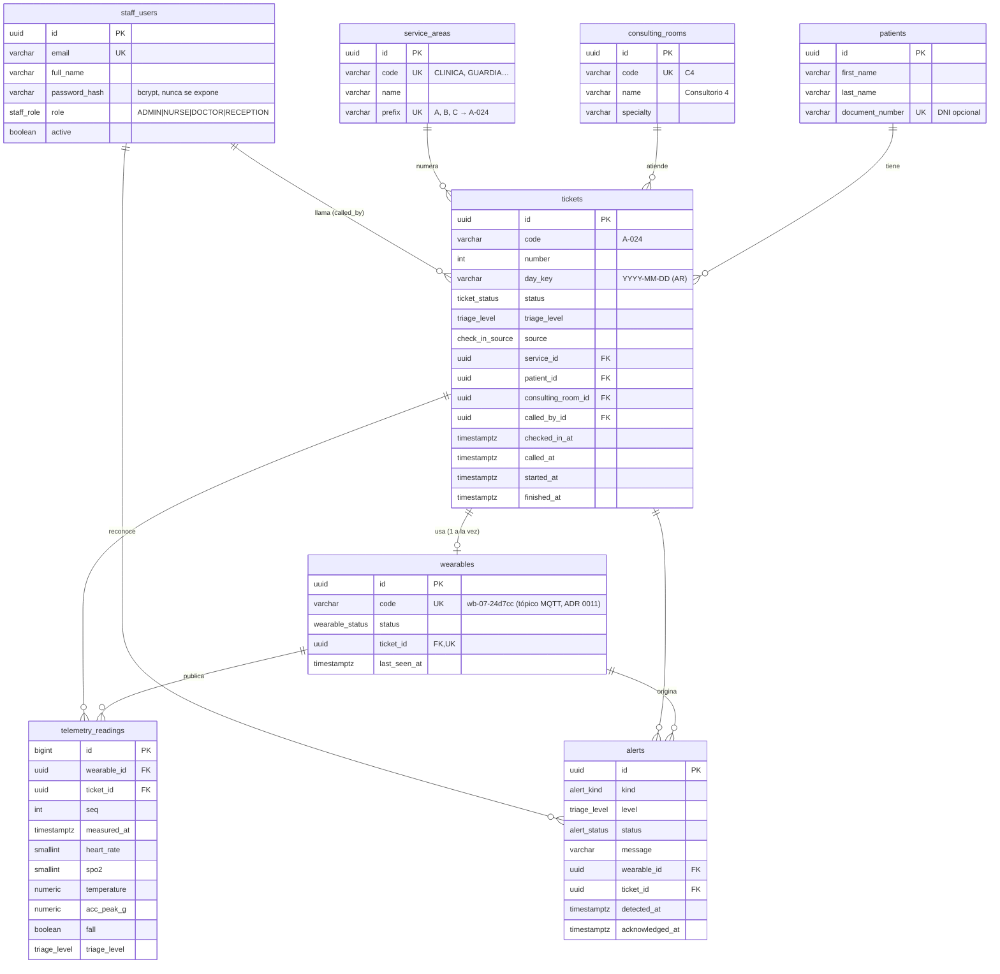

# 08 · Modelo de datos

PostgreSQL 16 con **TypeORM** ([ADR 0009](adr/0009-orm-typeorm.md)). Las entidades viven en `apps/api/src/modules/<dominio>/entities/`, el registro único en `apps/api/src/database/entities.ts` y las migraciones en `apps/api/src/database/migrations/`.

## Diagrama entidad-relación



## Reglas del modelo

| Regla                                                                             | Implementación                                                                           |
| --------------------------------------------------------------------------------- | ---------------------------------------------------------------------------------------- |
| La numeración de turnos reinicia por servicio y día operativo (hora de Argentina) | `UNIQUE (service_id, day_key, number)`, con reintento ante colisión en el check-in       |
| Una pulsera se asigna a un solo turno a la vez                                    | `wearables.ticket_id UNIQUE`                                                             |
| La fila se consulta por estado, triaje y llegada                                  | Índice `ix_tickets_queue (status, triage_level, checked_in_at)`                          |
| La telemetría se consulta por pulsera o turno en el tiempo                        | Índices `(wearable_id, measured_at)` y `(ticket_id, measured_at)`                        |
| Datos mínimos del paciente (Ley 25.326)                                           | Solo nombre, apellido y DNI opcional. Las respuestas muestran `displayName` ("Lucía G.") |
| Contraseñas                                                                       | Hash bcrypt (`password_hash`, `select: false`)                                           |
| IDs                                                                               | `uuid` con `gen_random_uuid()`. Las lecturas usan `bigint` autoincremental por volumen   |

Los enums de PostgreSQL (`staff_role`, `ticket_status`, `triage_level`, `check_in_source`, `wearable_status`, `alert_kind`, `alert_status`) usan los mismos valores que `@vitalia/contracts`.

## Tablas por fase

| Tabla                                                                     | Se usa desde                                   |
| ------------------------------------------------------------------------- | ---------------------------------------------- |
| `staff_users`, `service_areas`, `consulting_rooms`, `patients`, `tickets` | Fase 1 ✅                                      |
| `wearables`, `telemetry_readings`, `alerts`                               | Fase 2 (ya creadas; el seed asigna 4 pulseras) |

## Comandos

```bash
pnpm db:migrate                      # aplicar migraciones pendientes
pnpm db:generate --name=AddXxx       # generar migración por diff (revisarla y registrarla en migrations/index.ts)
pnpm db:revert                       # revertir la última
pnpm db:show                         # estado de las migraciones
pnpm db:seed                         # datos simulados (idempotente)
pnpm db:reset                        # drop + migrate + seed (solo desarrollo)
```

## Datos del seed (desarrollo)

| Tipo                            | Datos                                                                                                               |
| ------------------------------- | ------------------------------------------------------------------------------------------------------------------- |
| Servicios                       | `CLINICA` (A) · `GUARDIA` (B) · `PEDIATRIA` (C)                                                                     |
| Consultorios                    | C1–C4 y G1 (Box de Guardia)                                                                                         |
| Usuarios (clave `Vitalia2026!`) | `admin@`, `enfermeria@`, `medico@`, `pediatria@`, `recepcion@` + `vitalia.local`                                    |
| Wearables                       | `wb-01-24d7cc` (pulsera real) y `wb-02-5e0002` … `wb-08-5e0008` (simuladas); cuatro asignadas a pacientes en espera |
| Turnos del día                  | 14 en distintos estados y niveles de triaje                                                                         |
